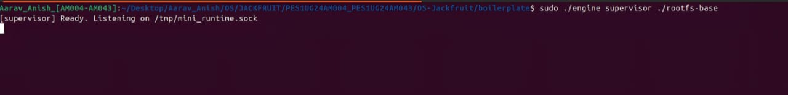
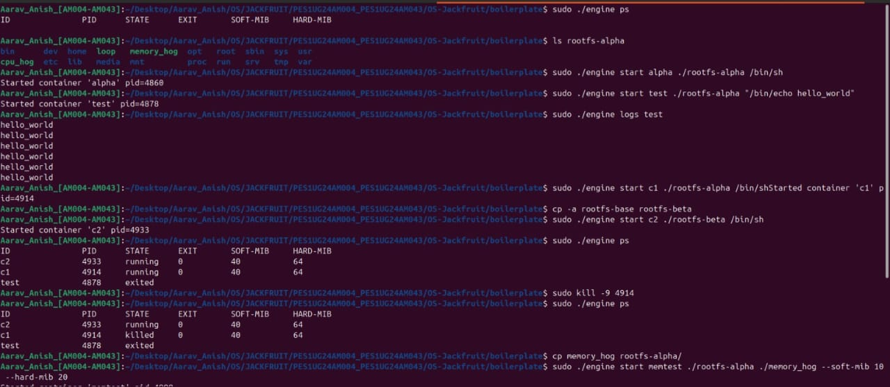
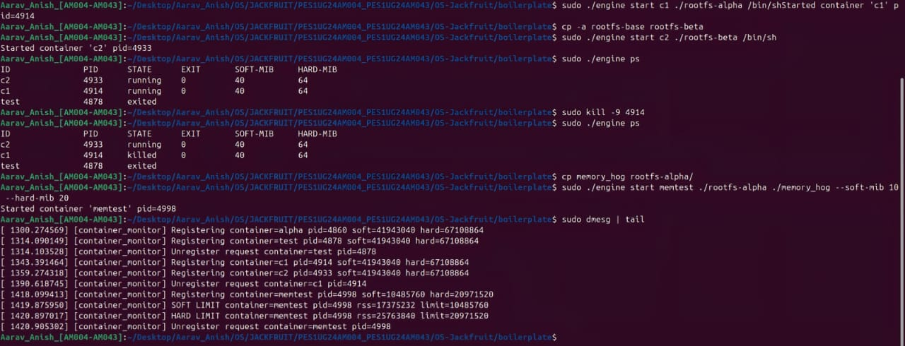
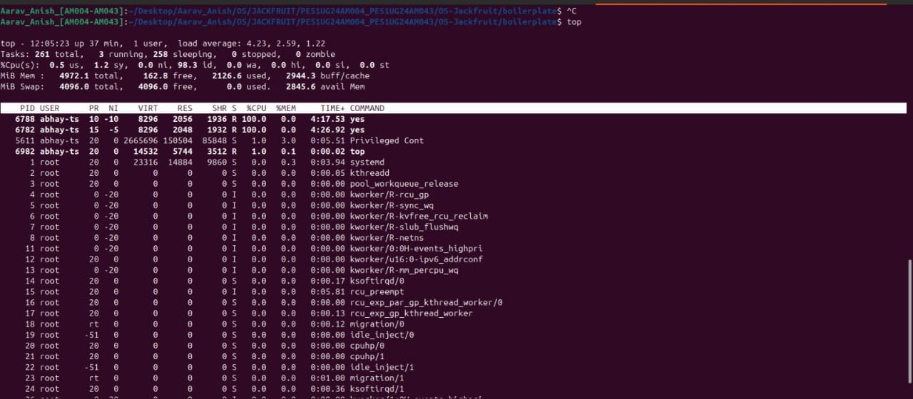
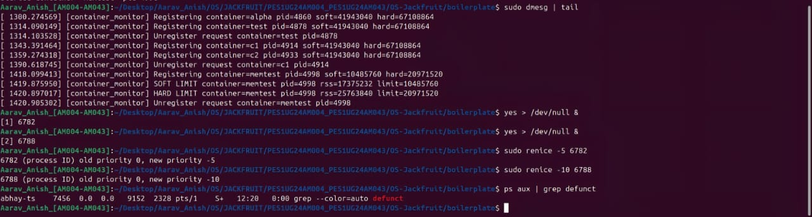

# Jackfruit OS: Custom Container Engine

**Team Members:**
* Aarav Yuval B G (SRN: PES1UG24AM004)
* Anish Kumar (SRN: PES1UG24AM043)

## Project Overview
This project implements a lightweight container engine and runtime environment written in C. The architecture consists of a persistent supervisor daemon and a command-line interface, demonstrating core operating system concepts including process isolation, container lifecycle management, kernel-level memory thresholds, and CPU scheduling priorities.

---

## 1. The Supervisor Daemon
The supervisor serves as the persistent backend manager for the container runtime. It binds to a UNIX domain socket (`/tmp/mini_runtime.sock`) to listen for incoming client commands. This daemon is responsible for the allocation, tracking, and teardown of isolated container environments, acting as the parent process for all generated containers.

*Figure 1: Initialization of the supervisor daemon, successfully binding and listening on the designated socket.*

---

## 2. Container Lifecycle and Filesystem Isolation
The engine manages a complete and robust container lifecycle. The system is capable of executing both persistent environments (running a shell) and temporary automated tasks (executing a single command and exiting cleanly). 

Filesystem isolation is achieved by mounting containers to distinct root directories. By cloning the `rootfs-base` directory into a secondary `rootfs-beta` environment, we verify that independent containers operate within completely isolated filesystems without overlap.

*Figure 2: The process status output verifying active running containers, successfully exited temporary tasks, and the accurate state update of a forcefully terminated container (`c1`).*

---

## 3. Kernel-Level Memory Management
To enforce resource restrictions, the project utilizes a custom kernel module (`container_monitor`). This module actively tracks the Resident Set Size (RSS) of running containers and enforces memory boundaries directly at the operating system level.

* **Soft Limit (10 MiB):** Triggers a kernel-level warning logged via `dmesg` when the container's physical memory footprint exceeds the threshold.
* **Hard Limit (20 MiB):** Acts as an Out-Of-Memory (OOM) threshold. If breached, the monitor intercepts the violation, sends an immediate termination signal to the container, and forcefully unregisters the process.

*Figure 3: System kernel logs demonstrating the `memtest` container triggering the 10 MiB soft limit warning, followed by an immediate termination upon breaching the 20 MiB hard limit.*

---

## 4. CPU Niceness and Scheduling Enforcement
The engine accurately leverages Linux CPU scheduling priorities. To validate this, multiple infinite-loop background tasks (`yes > /dev/null &`) were instantiated to generate heavy, competing CPU loads. 

Using the `renice` command, process priorities were dynamically modified. The operating system's scheduler successfully recognized the updated niceness values, granting priority processing time to the designated containers.

*Figure 4: Real-time system monitor output verifying successful priority allocation. Process 6788 operates with a `-10` niceness value, while process 6782 operates at `-5`.*

---

## 5. Process Cleanup and Zombie Prevention
A critical requirement of a reliable container supervisor is the proper handling of process termination to prevent memory leaks. The daemon must accurately reap child processes after they exit organically or are forcefully terminated by the kernel monitor.

Following comprehensive lifecycle and OOM termination testing, a system-wide search for orphaned or zombie processes was conducted to verify the supervisor's cleanup routines.

*Figure 5: Execution of `ps aux | grep defunct` returning only the search command itself. This validates that the engine successfully reaps all child processes, leaving zero zombie processes within the system.*